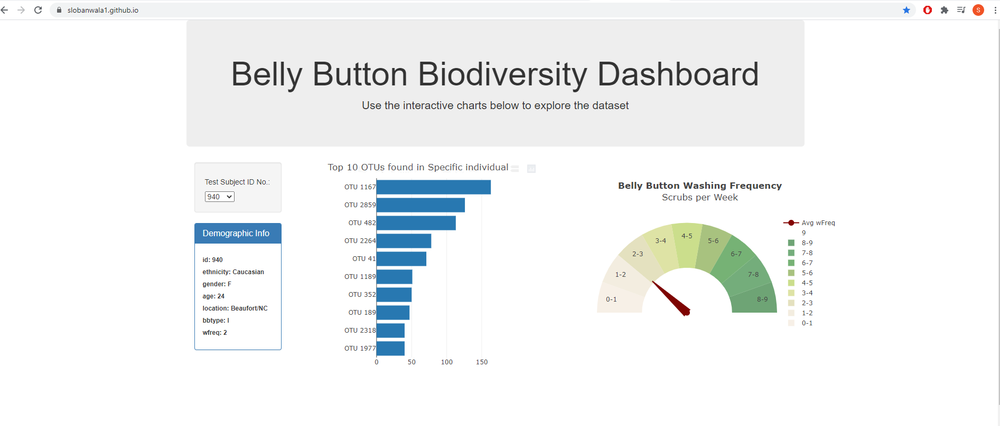
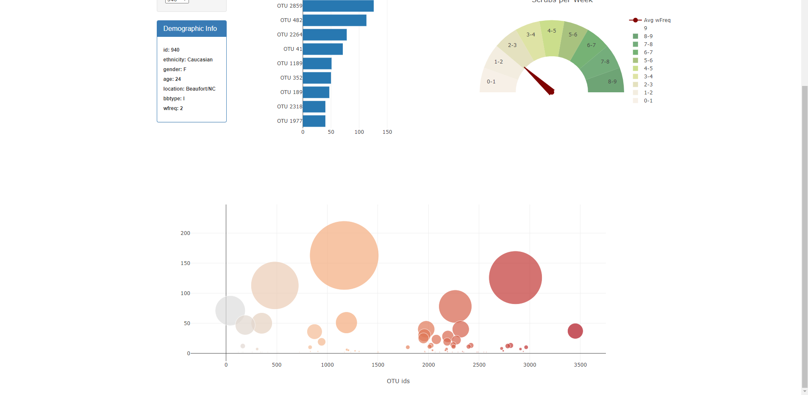

# Plot.ly Homework - Belly Button Biodiversity

In this homework we used d3 to traverse through JSON data,
store it in tables, display it in charts, and finally manipulate
a object to show the value of the frequency.

The link to the working hosted webpage is:

# https://slobanwala1.github.io/

Here is a pic of it fully working:

**Page 1**

 
 

**Page 2**

 
 

